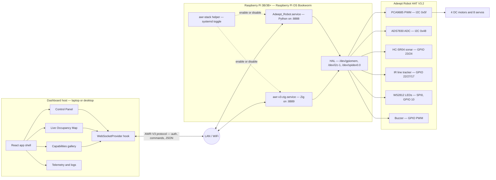
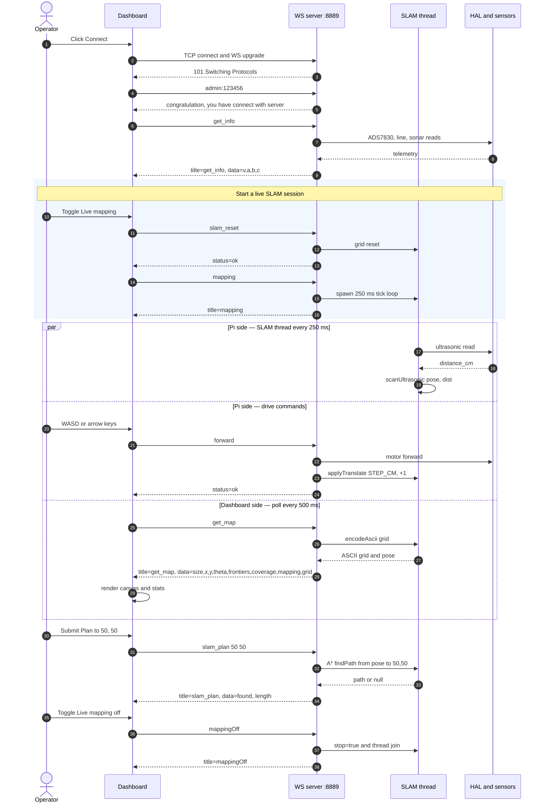

# Adeept AWR-V3 Dashboard

A modern web dashboard and control interface for the [Adeept AWR-V3](https://www.adeept.com/) 4WD smart robot platform, built with React, TypeScript, Tailwind CSS v4, and shadcn/ui patterns.

## Overview

This project provides:

- **Robot cockpit** — playful, mobile-friendly control surface for driving, lights, buzzer demos, camera tilt, sensor checks, and kid-friendly examples
- **Decoupled robot firmware connection** — the dashboard runs locally/as a PWA and connects to any remote AWR-V3 WebSocket firmware endpoint
- **Capabilities & Roadmap gallery** — separates currently usable dashboard surfaces from features that still need robot, backend, or hardware work
- **Camera view** — MJPEG stream viewer connecting to the robot's Flask video feed
- **Live SLAM panel** — toggles `mapping`/`mappingOff` on the firmware, polls `get_map`, renders the live occupancy grid plus pose, and exposes A\* `slam_plan` queries
- **Occupancy mapping (sim)** — canvas-based 2D occupancy grid prototype that runs entirely in the browser for UI demos when no robot is connected
- **Resources hub** — original Adeept Learn/product links, ZIP resource links, and project repositories without turning the main page into a manual
- **WebSocket firmware simulator** — Node-based server that mimics the AWR-V3 protocol (including SLAM commands) for local development without hardware
- **Standalone Python recovery explorer** — cautious finite-state exploration script that runs outside the vendor robot service while reusing the original Python hardware modules

## Prerequisites

- [Node.js](https://nodejs.org/) 22+ (use `scripts/setup-dashboard.sh` to verify and install dependencies)

## Quick Start

```bash
# One-shot local setup (verifies Node, runs npm install, prints next steps)
bash scripts/setup-dashboard.sh

# Start the local robot firmware simulator (port 8889)
npm run robot:sim

# Start the development server (port 8080)
npm run dev
```

Open [http://localhost:8080](http://localhost:8080) in your browser.

## Decoupled Robot Architecture

The dashboard is not intended to be served by the robot. Treat it as a local/PWA/native-wrapper app that connects to a remote robot firmware endpoint. The robot side should only own hardware and expose the AWR-V3 WebSocket protocol.

- Local firmware simulator: `ws://localhost:8889`
- Original/Python-compatible robot server: `ws://raspberry-pi.local:8888`
- Zig firmware server: `ws://raspberry-pi.local:8889`

The auth handshake is configurable in the UI and defaults to `admin:123456`. The camera app accepts a full MJPEG URL, so the original Flask stream and a future Zig/V4L2 stream can share the same dashboard contract.



Only one of `Adeept_Robot.service` (vendor Python, `:8888`) and `awr-v3-zig.service` (this project's Zig firmware, `:8889`) should be active at a time on a given Pi — they share the same I²C and GPIO pins on the HAT. The `awr-stack` helper makes that toggle one command (see below). The dashboard's connection presets cover both ports out of the box.

Local development loop:

```bash
npm run robot:sim   # robot firmware simulator on ws://localhost:8889
npm run dev         # dashboard/PWA on http://localhost:8080
```

### Same WiFi LAN: dashboard on a laptop, robot on the Pi

1. Join the Pi and your computer to the **same network** (home Wi‑Fi access point). The Pi hostname `raspberry-pi.local` only works reliably where mDNS is available (many home routers are fine).
2. On the Pi, run one robot control stack — **Python vendor server** (`WebServer.py`-style, usually port **8888**) or **Zig firmware** (default port **8889**). Firewall must allow inbound TCP on that port from your LAN subnet.
3. On the laptop: `npm run dev`, open **http://localhost:8080** (dashboard is not deployed to the Pi in this workflow).
4. In **Robot Control Deck → Connect**, enter:
   - **Python robot:** `ws://<pi-lan-ip>:8888` (or `ws://raspberry-pi.local:8888`)
   - **Zig firmware:** `ws://<pi-lan-ip>:8889` (or `ws://raspberry-pi.local:8889`)
   Auth is usually `admin:123456`; override if you changed defaults.
5. For **Live Camera**, set the MJPEG URL to the Flask stream, often `http://<pi-lan-ip>:5000/video_feed` (or the preset that matches your network).

### Running both stacks side-by-side on the Pi

The dashboard is additive: it does **not** replace the vendor Python stack. Use the [`zig-awr-v3`](https://github.com/danielzurawski/zig-awr-v3) installer once on the Pi, and the `awr-stack` helper to swap which firmware is active.

```bash
# On the Pi (one-shot, vendor stack is not touched):
git clone https://github.com/danielzurawski/zig-awr-v3.git
sudo bash zig-awr-v3/scripts/install-pi.sh

awr-stack status     # show vendor + Zig services
awr-stack zig        # switch to Zig firmware  (port 8889)
awr-stack python     # switch back to vendor Python (port 8888)
awr-stack stop       # stop both for manual examples
```

In the dashboard, change the **Endpoint preset** in the connection bar to match (`Python robot` vs `Zig robot`). Both backends speak the same auth + commands, plus the Zig backend adds the `mapping`/`get_map`/`slam_plan` SLAM commands used by the **Live Occupancy Map** panel.

## Standalone Python Recovery Explorer

`tools/python_recovery_explorer.py` is designed to be copied to the Pi and run independently of `Adeept_Robot.service`:

```bash
sudo systemctl stop Adeept_Robot.service
cd ~/Adeept_AWR-V3
python3 ~/python_recovery_explorer.py --speed 30 --max-steps 80
```

Create `/tmp/stop_recovery_explorer` or press `Ctrl-C` to park it. The script never performs blind reverse recovery by default: it stops, alerts, scans headings in place with sonar, turns toward the best clear corridor, and parks if none is found. It writes `recovery_explorer_status.json` and `recovery_explorer_map.pgm` after each step.

## Running Tests

The protocol acceptance suite validates the WebSocket flow against the local simulation server (it **starts and stops** `ws-server.mjs` automatically):

```bash
npm run test:protocol
```

To keep a simulator running while you debug by hand, use a second terminal:

```bash
npm run robot:sim   # optional: leave running on port 8889
```

If you already ran **`npm run robot:sim`** manually (still the Node simulator), you can run tests **without** spawning a second listener:

```bash
npm run test:protocol:only
```

These checks currently assume the Node simulator (`/capabilities`, `/state`, authentication strings). They are **not** a substitute for Zig-on-hardware validation unless you mirror those HTTP endpoints and strings in Zig.

The tests cover authentication, telemetry, capabilities discovery, and action effects. They assert that commands such as speed changes, movement, stop, camera tilt, lights, tunes, LED switches, robot modes, and servo calibration mutate the simulator's `/state` endpoint instead of only returning `ok`.

### End-to-end black-box acceptance (no Pi required) — dual-stack

The companion **`zig-awr-v3`** repo ships `scripts/run-functional-acceptance.sh`, which boots a **Raspberry Pi OS Bookworm** (`linux/arm64`) Docker image and runs the *entire* AWR-V3 stack end-to-end — both implementations:

- Zig firmware: `install-pi.sh`, the compiled binary, full SLAM protocol test, `awr-stack` toggles, `uninstall-pi.sh`.
- Vendor Python firmware (the original Adeept stack): `setup.py`, the real `WebServer.py` running on `:8888` with hardware stubs, the same generic black-box WS protocol test (common subset, no SLAM), additive install on top of the Zig stack, and final cleanup.
- This dashboard's `npm run test:protocol` against the Node simulator.
- A live **dual-stack phase** that brings vendor Python (`:8888`) and Zig (`:8889`) up *concurrently* and runs the protocol acceptance against both at the same time.

From the parent directory of both repos:

```bash
# Optional: point at the vendor V3 source (auto-detected from
# ~/Downloads/Adeept_AWR-V3-*/Code/Adeept_AWR-V3 if not set)
export VENDOR_SRC=/path/to/Adeept_AWR-V3
bash zig-awr-v3/scripts/run-functional-acceptance.sh
```

Currently **88 / 88 PASS** across **13 phases**, ~100 s on Apple Silicon. This is the closest thing to a Pi-on-the-bench reproduction without the hardware, and is what should run before merging any change to either side of the protocol contract.

## Type Checking & Linting

```bash
# TypeScript strict mode type checking
npx tsc -b --noEmit

# ESLint
npx eslint src/
```

## Project Structure

```
adeept-dashboard/
├── src/
│   ├── App.tsx                          # Main layout with navigation, WebSocketProvider wrapper
│   ├── main.tsx                         # React entry point
│   ├── index.css                        # Tailwind v4 theme
│   ├── lib/utils.ts                     # cn() utility
│   ├── hooks/useWebSocket.tsx           # WebSocket provider + hook (latestMap from get_map stream)
│   ├── components/
│   │   ├── Hero.tsx                     # Overview section
│   │   ├── ControlPanel.tsx             # Interactive robot controls + Live Mapping mode toggle
│   │   ├── ResourcesSection.tsx         # Source links and implementation notes
│   │   ├── apps/
│   │   │   ├── AppGallery.tsx           # Capabilities and roadmap gallery
│   │   │   ├── CameraView.tsx           # MJPEG stream viewer
│   │   │   ├── LiveOccupancyMap.tsx     # Real backend SLAM streaming panel
│   │   │   └── OccupancyMap.tsx         # 2D grid mapping simulation (browser-only)
│   │   └── ui/                          # shadcn-style primitives
│   │       ├── button.tsx
│   │       ├── card.tsx
│   │       ├── badge.tsx
│   │       ├── tabs.tsx
│   │       └── separator.tsx
├── scripts/
│   ├── run-protocol-tests.mjs         # Starts simulator, runs protocol tests, exits
│   └── setup-dashboard.sh             # One-shot local setup: Node check + npm install
├── tests/
│   └── ws-protocol.test.mjs            # Node protocol acceptance tests (incl. SLAM)
├── tools/
│   └── python_recovery_explorer.py      # Standalone cautious Python autonomy
├── ws-server.mjs                        # Node WebSocket firmware simulator
├── vite.config.ts
├── tsconfig.json
├── tsconfig.app.json
└── eslint.config.js
```

## WebSocket Protocol

The control panel and simulation server implement the AWR-V3 WebSocket protocol:

| Command | Description |
|---------|-------------|
| `admin:123456` | Authentication handshake |
| `forward`, `backward`, `left`, `right`, `rotate-left`, `rotate-right` | Movement |
| `DS`, `TS` | Direction/turn stop |
| `up`, `down`, `UDstop` | Camera tilt |
| `wsB N` | Set speed (0-100) |
| `findColor`, `motionGet`, `automatic`, `trackLine`, `keepDistance`, `police`, `CVFL` | Function on |
| `stopCV`, `automaticOff`, `trackLineOff`, `keepDistanceOff`, `policeOff` | Function off |
| `Switch_N_on`, `Switch_N_off` | LED port control (N=1,2,3) |
| `SiLeft N`, `SiRight N`, `PWMMS N`, `PWMINIT`, `PWMD` | Servo calibration |
| `get_info` | Returns `{status, title:"get_info", data:[cpuTemp, cpuUse, ramUse, battery]}` |
| `{"title":"findColorSet","data":[H,S,V]}` | JSON color config |
| `tone NOTE MS`, `tune baby_shark`, `tune happy_birthday`, `tune seven_notes` | Zig/simulator buzzer demos |
| `lights_breath_blue`, `lights_rainbow`, `lights_flowing`, `lights_off` | Zig/simulator WS2812 demos |
| `mapping`, `mappingOff` | Toggle the background SLAM mapping thread (Zig/simulator) |
| `slam_reset` | Reset occupancy grid and pose |
| `get_map` | Returns `{title:"get_map", data:{size, cell_cm, x, y, theta, frontiers, coverage, mapping, grid}}` |
| `slam_plan X Y` | Returns `{title:"slam_plan", data:{found, length}}` (A\*) |

### Protocol sequence — full live SLAM session

The exchange the dashboard performs against the firmware (Zig binary or Node simulator — same contract) when the operator opens **Live Occupancy Map** and drives the robot:



This is the contract the protocol acceptance suite asserts against, end-to-end: `tests/ws-protocol.test.mjs` exercises it against the Node simulator, and the [zig-awr-v3 black-box acceptance run](#end-to-end-black-box-acceptance-no-pi-required) drives the same exchange against a real compiled Zig binary running inside a Pi OS Bookworm container.

## Tech Stack

- **React 19** + **TypeScript 6**
- **Vite 8** with HMR
- **Tailwind CSS v4** via `@tailwindcss/vite`
- **class-variance-authority** + **tailwind-merge** for component variants
- **Lucide React** icons
- **Node + ws** for the local robot firmware simulator

## Hardware Compatibility

Designed for the Adeept AWR-V3 robot with:
- Raspberry Pi 3B/3B+/4/5
- Adeept Robot HAT V3.2 (PCA9685 + ADS7830 + DRV8833)
- HC-SR04 ultrasonic, 3-CH IR line tracker, WS2812 LEDs, camera module

## License

Apache License 2.0 — see [LICENSE](LICENSE) for details.